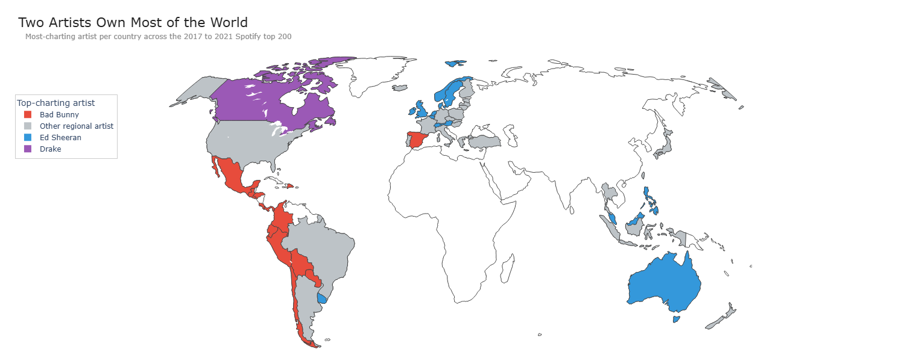
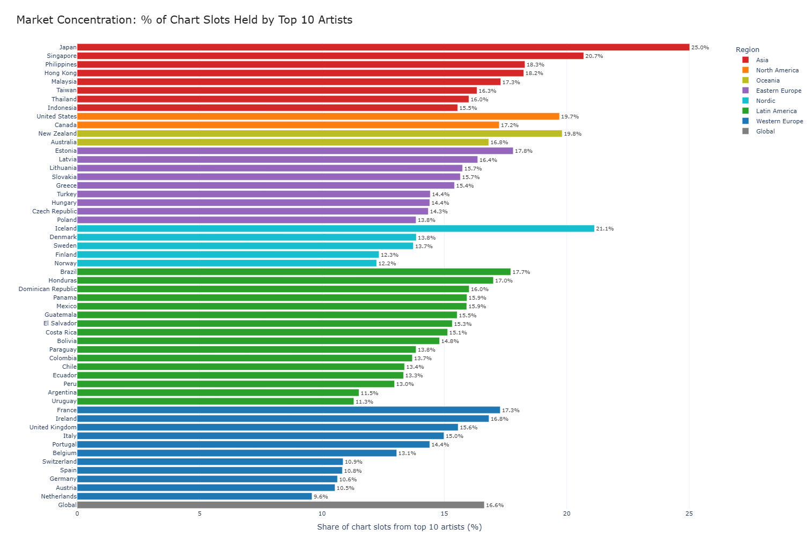
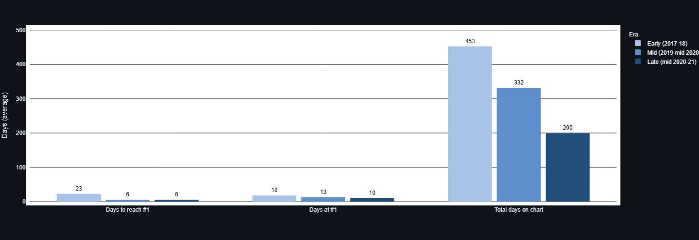

# Spotify Charts: A Cross-Market Analysis (2017-2021)

A SQL-driven analysis of how music consumption differs across 70+ countries,
using 26 million Spotify chart entries from 2017 to 2021.

**Live demo:** [spotify-charts-mokshpatel.streamlit.app](https://spotify-charts-mokshpatel.streamlit.app/)

## Headline Finding

**Two artists own most of the world, and they don't overlap.**

|                                  | Bad Bunny  | Ed Sheeran  |
|----------------------------------|------------|-------------|
| Countries where #1 most-charting | 13         | 15          |
| Region                           | Latin America + Spain | English-speaking world + Northern Europe |
| Linguistic gravity               | Spanish    | English     |

Across 54 countries with five years of complete chart data, two artists
combined topped 28 countries with no geographic overlap. Drake, often
assumed to be a global force, was the most-charting artist in just one
country: Canada.



## Findings

### Q1: Market concentration
For each country I measured what share of all top-200 chart slots over five
years went to its top 10 artists. The most concentrated charts are in
**Japan (25.0%), Iceland (21.1%), Singapore (20.7%), and the United States
(19.7%)**. The most diverse are in Western Europe: **Netherlands (9.6%),
Austria (10.5%), Germany (10.6%)**. Asian markets and small-population
countries cluster their listening around fewer artists. Western European
markets blend domestic and international music broadly. The Japan-vs-Netherlands
gap is roughly **2.6x**.



### Q2: Song lifecycle and the streaming-era acceleration
For US #1 hits between 2017 and 2021 I tracked how long each song took to
reach #1, how long it stayed there, and how long it lingered on the chart.
**Songs reach #1 nearly 4x faster now than they did in 2017-18 (22.6 days
down to 5.7 days), and total chart lifespan has halved (452 days down to 199
days)**. The streaming-era hypothesis that hits are quicker to peak and
quicker to die out is real and it shows up cleanly in the data.



### Q3: Single-artist dominance per country
For each country I found the most-charting artist and what share of the
chart they held. **Bad Bunny was #1 in 13 Latin American and Spanish-speaking
markets. Ed Sheeran was #1 in 15 English-speaking and Northern European
markets**. The remaining 26 countries each have a unique national or
regional artist (Ninho in France, Official HIGE DANdism in Japan, Ezhel in
Turkey). Honduras and the Dominican Republic are the most artist-concentrated
markets in the world: Bad Bunny alone holds over 5% of every chart slot in
those countries across five years.

## Tools

- **Database:** DuckDB (chosen over SQLite to handle 26M rows efficiently on
  a laptop)
- **Source:** [Spotify Charts on Kaggle](https://www.kaggle.com/datasets/dhruvildave/spotify-charts), 26.2M rows
- **SQL editor:** VS Code with the Jupyter extension
- **Visualization:** Plotly for interactive charts, Streamlit for the deployed dashboard
- **Hosting:** Streamlit Community Cloud (free public hosting)

## Repository Structure

```
spotify-charts-analysis/
├── README.md                           this file
├── requirements.txt                    Python dependencies for the dashboard
├── .gitignore                          excludes the 3GB CSV
├── sql/
│   ├── 00_data_quality_notes.md        documented filtering decisions
│   ├── 01_market_concentration.sql     Q1: top-10 share per country
│   ├── 02_song_lifecycle.sql           Q2: #1 hit lifecycle
│   └── 03_artist_dominance.sql         Q3: single-artist dominance
├── data/
│   ├── 01_market_concentration.csv
│   ├── 02_song_lifecycle.csv
│   ├── 02_song_lifecycle_by_era.csv
│   └── 03_artist_dominance.csv
├── notebooks/
│   ├── 01_data_loading.ipynb           query runner
│   └── 02_visualizations.ipynb         chart generation
├── app/
│   └── streamlit_app.py                deployed dashboard
└── charts/
    ├── 01_market_concentration.html    interactive Plotly versions
    ├── 02_song_lifecycle.html
    ├── 03_artist_dominance.html
    ├── 01_market_concentration.png     static PNGs for this README
    ├── 02_song_lifecycle.png
    └── 03_artist_dominance.png
```

## SQL techniques demonstrated

- Multiple chained CTEs across all three queries
- Window functions: `ROW_NUMBER() OVER (PARTITION BY ...)` for ranking
  artists within each country, and partitioned `SUM()` for putting
  country-level totals on the same row as artist-level data
- Conditional aggregation with `CASE WHEN` to bucket songs into eras and
  count days at #1 from a daily ranking
- `INNER JOIN` to filter chart appearances to only songs that ever hit #1
- `DATE_DIFF()` for computing lifecycle durations in days
- Subquery filtering with `IN (SELECT ...)` for the country fairness filter

## Methodology

### Country fairness filter

The dataset covers 1,826 days (January 2017 through December 2021), but not
every country has charts for the full period. South Korea has only 302 days
of data, Egypt 787, Luxembourg 297, and others are similarly thin. Including
these countries in cross-country comparisons would mix five-year averages
with one-year averages, which isn't fair.

For Q1 and Q3, queries filter to countries with at least 1,500 days of
`top200` chart data. That keeps 54 countries (the ones with mostly-complete
coverage) and removes 15 with serious gaps.

### Per-country dominance share

Each row in the `charts` table is one (date, country, rank) chart slot.
Counting "appearances" by artist is therefore a count of chart slots that
artist filled across the period. Dividing by total country slots gives a
fair share figure across countries of different sizes.

## Data caveats

Two documented decisions, both with notes in
[`sql/00_data_quality_notes.md`](sql/00_data_quality_notes.md):

- **15 countries excluded from concentration analyses** because their chart
  data covers fewer than 1,500 of the 1,826 days in the period. Most
  notable: South Korea (302 days). K-pop dominance is a real phenomenon
  worth measuring, but the data doesn't support a fair comparison so it has
  to be left out of the cross-country analyses here.
- **4 catalog songs excluded from Q2's per-era trend** because their journey
  from first chart appearance to first #1 took longer than 365 days. The
  songs are White Christmas (Bing Crosby), Monster Mash (Bobby Pickett),
  Rockin' Around The Christmas Tree (Brenda Lee), and Heat Waves (Glass
  Animals). They are an interesting phenomenon on their own (streaming
  resurrects old music in ways pre-streaming charts never did), but they
  distort the per-era averages because their climb is measured in years
  rather than days.

## Roadmap

- [x] Q1: Market concentration by country
- [x] Q2: Song lifecycle and the streaming-era acceleration
- [x] Q3: Single-artist dominance per country
- [x] Plotly visualizations for each finding
- [x] Streamlit dashboard with country-level explorer
- [x] Deployed to Streamlit Community Cloud

### Future extensions

- Audio features layer: join the chart data to Spotify's audio features
  (tempo, danceability, energy) to ask whether different countries prefer
  sonically different songs
- Genre classification: tag each top artist with a primary genre to study
  whether genre consumption varies by region as much as artist consumption
  does
- Holiday seasonality: dedicated analysis of how Christmas/Halloween catalog
  songs return to the chart year after year, the phenomenon that originally
  showed up as outliers in Q2

## Reproducing this analysis

1. Download the dataset from
   [Kaggle](https://www.kaggle.com/datasets/dhruvildave/spotify-charts).
   You'll need a free Kaggle account.
2. Unzip and place `charts.csv` in the `data/` folder of this repo.
3. Open `notebooks/01_data_loading.ipynb` in VS Code (with the Jupyter
   extension) and run all cells. The notebook will load the CSV into a
   DuckDB database file (`data/spotify.duckdb`) and run all three queries.
4. Run `notebooks/02_visualizations.ipynb` to generate the Plotly charts.
5. To run the dashboard locally:
   `pip install -r requirements.txt` then `streamlit run app/streamlit_app.py`.

The full data import takes about a minute on a modern SSD. After that, each
query against the DuckDB table runs in 1-3 seconds.
